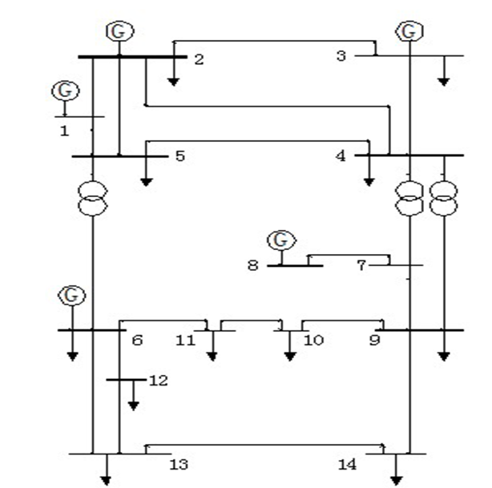

交通网部分

（1）：文件说明：

TNplus.py： 交通网对象声明类，里面塞了行为相关函数，除了类定义外大多数不需要在运行的代码里直接调用
simuplus.py：启动运行以及数据导入与处理，跑模拟导入数据直接运行它就行
processnetTNTP.py：用来将TNTP文件转为csv，此处来源于bstabler的github
loaddata.py：包含一部分数据处理函数，在simuplus前面有调用
structure.txt：我的草稿......

（2）：交通网对象说明：

调度中心：负责存各种数据以及调度车辆，这里所有数据都是直接存的对象

    class DispatchCenter:
        def __init__(self, vehicles, edges, nodes, charge_stations):
            存储四大主体的集合，都是直接存的对象而非id
            :param vehicles: 车辆集合（对象）
            :param edges: 道路集合（对象）
            :param nodes: 交叉口集合（对象）
            :param charge_stations: 充电站集合（对象）

车辆对象：存储车辆信息，包含车辆的行为函数

    class Vehicle:
        def __init__(self, id, center, origin, destination, distance, road, next_road, path, Emax, E, Ewait, Edrive, iswait, charge, index=0, charging = False): 
            存储车辆信息
            :param id: 车辆id
            :param center: 所属调度中心（对象）
            :param origin: 起点id
            :param destination: 目的地id
            :param distance: 距下次转弯所需距离
            :param road: 当前道路id（已到达终点为-1）
            :param next_road: 下一道路id(无下一道路为-1)
            :param path: 车辆路径
            :param Emax: 最大电池储能
            :param E: 当前储能
            :param Ewait: 等待时平均耗能
            :param Edrive: 驾驶时平均耗能
            :param iswait: 是否在等待信号灯
            :param charge: 分配的充电站id与充电桩功率（id, power）
            :param index: 坐标符，在path中指向下一道路
            :param charging: 是否在充电

道路对象：存储道路信息

    class Edge: 
        def __init__(self, id, center, origin, destination, length, capacity, free_time, b, power):
            """
    
            道路对象类定义
            :param id: id
            :param center: 所属调度中心
            :param origin: 道路起点节点id
            :param destination: 道路终点节点id
            :param length: 道路长度
            :param capacity: {{to: cap, x}} 表示各方向车道组的容量(内为字典),to为下一条道路的id
            :param free_time: 无车流影响时正常行驶所需时间
            :param b: bpr公式参数
            :param power: bpr公式参数
            """

节点对象：存储节点信息

    class Node：
        def __init__(self, id, center, signal, wait, edge_num, enter, off):
            节点对象（即路口）
            :param id: 节点id
            :param center: 所属控制中心(对象)
            :param signal: {{fr, to}: {g, C}}, 表示每个方向信号灯所属绿灯时长与总周期时长
            :param wait: {{vid, t}} 表示正在等候的车辆的合集
            :param edge_num: 连接道路总数
            :param enter: 驶入该节点的道路id集合
            :param off: 驶出该节点的道路id集合

    

充电站对象：充电站信息，其中包含充电站的运行函数

    class ChargeStation:
        def __init__(self, id, center, dispatch, charge, queue, capacity, pile):
            """
            :param id:充电站id，与道路id一致
            :param center:所属控制中心(对象)
            :param dispatch: {v: atime} 表示分配到该站点但仍未到达的车辆，理想情形下按预计到达时间排序
            :param charge: {power:{id, t}} 表示正在充电的车辆与剩余充电时长
            :param queue: {power: {id, t}} 表示正在站内排队等候充电的车辆与其已等待时间
            :param capacity: 最大容量
            :param pile: (power: num) 表示站内充电桩功率与数量
            """

（3）：数据处理

processTNTP.py用来把tntp文件转为csv

loaddata.py里是csv数据处理的基础工具函数，以及用networkx实现的建网寻路，还有给定OD对数量随机分配的函数

simuplus.py里，main函数前半部分有读入csv数据然后定义道路和路口的部分，之后是往路网塞车子的部分，调度部分相关函数放在TNplus.py中的调度中心类模块里了

（4）：车子的行为模式

（5）：其他说明

是不是写个仿真信号灯版本的会好点emmmmm，虽然看以往文献没见几个考虑信号灯的

9.28起开始接入电网

10.2完成电网部分

采用一个ieee14模型模拟PDN。
目前在节点2， 4， 7， 8， 10， 14设置了六个充电站，对应SF交通网的1. 5. 11. 15. 16. 20号节点
电网1号节点为平衡节点。

每个充电站包括占大部分的充电桩可调负载和小部分的固定日常负载，图示数据为超充和快充各100根桩的情况。

    pp.create_load(net, bus=1, p_mw=17, q_mvar=3.4, min_p_mw=1, min_q_mvar=0.2, max_p_mw=17, max_q_mvar=3.4, name="EVCS 1", controllable=True)
    pp.create_load(net, bus=1, p_mw=0.03, q_mvar=0.006, name="EVCS 1 Auxiliary Load")

在simuplus.py中直接调用PDNplus.py中的函数完成路网数据定期导入以及功率调优

            if i > 1 and i % T_pdn == 1:
                total_charge_cost = {}
                for cs in center.charge_stations.values():
                    total_charge_cost[f"EVCS {cs.id}"] = cs.cost / 60 / 1000
                    cs.cost = 0
                PDNplus.update_load(pdn, total_charge_cost, 3 * T / 60)
                PDNplus.run(pdn, 30)
                pdn_loss = PDNplus.calculate_loss(pdn, 140)
                pdn_result.append(pdn_loss)

现在只剩数据调优的问题，截至10.2车流数据规模还比较小，产生的充电需求无法对电网ACOPF的解造成影响

10.3将数据规模扩大到原来的10倍

10.4：优化了输出控制，增加log属性

10.5：优化了dispatch模式，修复了逻辑bug

10.6：将修改电网部分，道路信息输出拟加入折线图功能

10.8讨论结果：路径调度加入电量考虑；加入电价考虑（接口）并丰富数据监测接口，未来该模型仍然主交通端调度。电网可以OPF但是结果有点反直觉，还得学emmmm

10.8：dispatch中加入数据接口

10.10：在路径调度中加入电量考虑， 接入充电站排队论估算函数

10.11：修复了充电站dispatch中预计到达时间显示错误的bug

10.31：终于记得更新这玩意了......现在取demo要做如下修改：
（1）把OD_result存起来，直接输入到simuplus里，保证车辆的OD不变
（2）模板策略替代掉随机数部分，方便对比
（3）assignment哪里要改一下，增加自主输入分配的模式